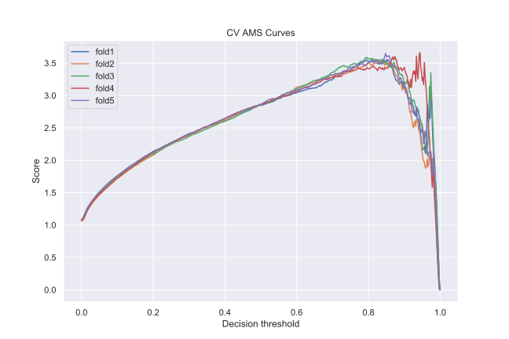
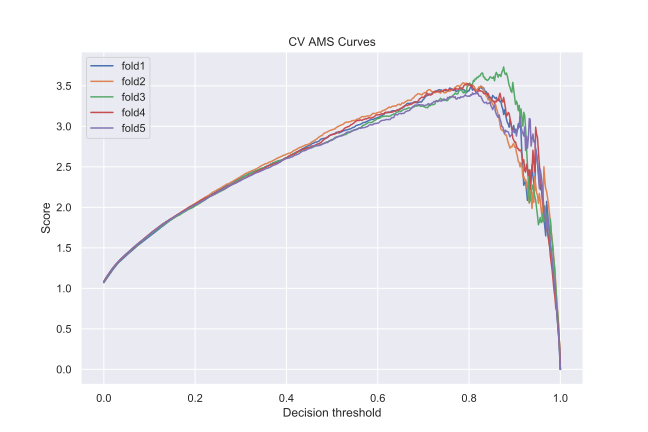

#masterdac2019 #reds #projet_higgsml

This repository contains our solution to the [Higgs Boson machine learning challenge](https://www.kaggle.com/c/higgs-boson) held on Kaggle in 2014.

The data is simulated data with features characterizing events of particle decays detected by the [ATLAS experiment](https://atlas.cern/).  The task is to classify the events into two classes, specifically "tau tau decay of a Higgs boson" events versus "background" events.
The ultimate goal is to improve the discovery significance of the experiment. The evaluation metric is the *approximate median significance (AMS)*, a function of a statistical test.

We used tree-based boosting and bagging techniques, specifically XGBOOST and random forest algorithm.

We applied an hyperparameters search procedure using the tree Parzen estimator algorithm with cross-validation. Additionally the threshold used to round probability predictions to one of the two classes was also tuned as an hyperparameter to maximize the AMS.

The CERN data can be downloaded at [this link](http://opendata.cern.ch/record/328).

## Results

| *Cross-validation best results*     | XGBOOST | Random forest |
| ------------------ | ------- | ------------- |
| Mean AMS           | 3.6011  | 3.5434        |
| Variance AMS       | 0.0023  | 0.0105        |
| Mean threshold     | 0.8541  | 0.8204        |
| Variance threshold | 0.0024  | 0.0009        |
| Best trial | 92      | 43            |

| AMS scores by dataset      | XGBOOST | Random forest |
| -------------------------- | ------- | ------------- |
| Train                      | 4.1752  | 4.8762        |
| Test (private leaderboard) | 3.4904  | 3.5274        |
| Public leaderboard         | 3.3889  | 3.4102        |

*Fig. 1: XGBOOST AMS scores vs threshold for each of the cross-validation folds used at the best trial (the trial with best mean max of curves).*

*Fig. 2: Random forest AMS scores vs threshold for each of the cross-validation folds used at the best trial.*

